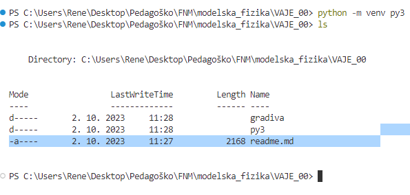
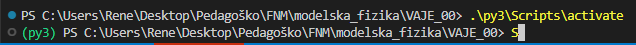
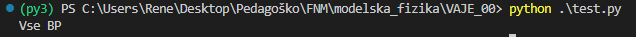

# Pričetek 

- Pretežno bomo uporabljaji python programski jezik.
- V določenih primerih obmo tudi kombinirali različne jezike, da dosežemo kaj se da unčinkovito rešitev.
- Potrebujemo stabilno okolje v katerem lahko naš model razvijamo in ga tudi distribuiramo.

# Virtualno okolje

Veliko krat se znajdemo v situacijo, ko želimo določeno kodo zagnati in je iz različnih razlogov ne moremo. Da zagotovimo stabilno delovnaje naše kodo je zato smoterno uporabiti t.i. virtualno okolje (ang. virtual enviroment).

Znotraj tega virtualnega okolja lahko uporabimo katerokoli verzijo python in kombinacijo knjižic, ki jo želimo. 

Na najbolj osnovni ravni ustvarimo virtualno okolje tako, da se v terminalu postavimo na lokacijo, kjer želimo virualno okolje namestiti.
Kot primer:

```Terminal
PS C:\Users\Rene\Desktop\Pedagoško\FNM\modelska_fizika\VAJE_00> 
```

Znotraj terminala sem se postavil v mapo kjer bom pričez z izdelavo vaj. Če si sedaj želimo ustvariti virtualno okolje za programiranje zaženemo ukaz:

```Terminal
python.exe -m venv [željeno_ime]
```

Recimo, da bom v mojem primeru usvaril okolje, ki se imenuje py3, v terminalu zaženem:

```Terminal
C:\Users\Rene\Desktop\Pedagoško\FNM\modelska_fizika\VAJE_00>python.exe -m venv py3
```




## Verzija pythona

Če želite uporabiti **python -m venv** in določiti različico programa Python, ki jo boste uporabljali v virtualnem okolju, se morate prepričati, da je v vašem sistemu nameščena želena različica programa Python.

Razpoložljive različice programa Python lahko preverite z ukazom:
```
py --list
```
v operacijskem sistemu Windows ali python --version v operacijskem sistemu Linux ali Mac. 

Nato lahko ustvarite navidezno okolje z določeno različico Pythona z ukazom 

```
py -X.Y -m venv [ime_okolja]
```
v sistemu Windows, kjer je X.Y številka različice. Če želite na primer uporabiti Python 3.6, lahko uporabite ukaz py -3.6 -m venv vend v sistemu Windows ali python3.6 -m venv vend v sistemu Linux ali Mac. S tem boste ustvarili navidezno okolje z imenom vend in interpreterjem Python 3.6.

## Aktivacija okolja

Ko je virtualno okolje ustvarjeno ga activiramo z ukazom
```Terminal
.\py3\Scripts\activate
```


Kot lahko vidimo, se sedaj v našem programskem okolju izpiše katero python okolje se uporalbja (py3)

## Knjižice / python moduli

Predem nadaljujemo je priporočljivo, da posodobimo ključno funkcijo za pridobivanje modulov, to je pip.

```PowerShell
python -m pip install -U pip
```

V krovni mapi se ustvarimo datoteki **requirements.txt**. V to mapo si bomo zapisali imena modulov, ki jih bo naš program potreboval in niso nujno že vključeni v osnovni python paket. V to datoteko si zapišimo module:

- numpy
- pandas
- matplotlib
- seaborn

in nato module namestimo z ukazom.

```PowerShell
pip install -r requirements.txt
```

# Testiranje okolja

Da preverimo, če naše okolje pravilno deluje lahko ustvarimo preprosto pytohn kodo, kjer uvozimo vse potebne knjižice in jo skušamo zagnati.

```Python
# test.py
import pandas as pd
import numpy as np
import matplotlib.pyplot as plt
import seaborn as sns

print("Vse BP")
```

In če so bili vsi koraki upešno izvršeni, bi na zaslonu oz. terminalu morali prejeti odziv **Vse BP**.




