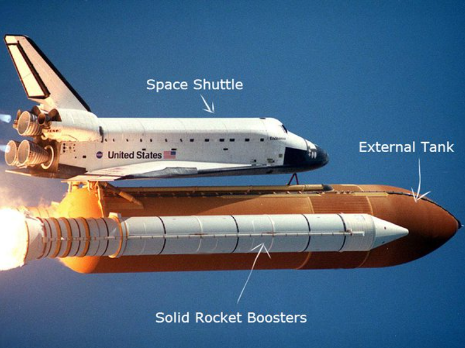

# Teoretično Ozadje: Izstrelitev Rakete

Raketa se dviga s pomočjo reakcijskega potiska, ki ga ustvarja izmetavanje goriva iz motorja. Ta princip delovanja je opisan z Newtonovim tretjim zakonom gibanja.

## Newtonov Tretji Zakon

Za vsako akcijo obstaja enaka in nasprotno usmerjena reakcija.

$$
\begin{equation}
F_{akcija} = -F_{reakcija}
\end{equation}
$$

## Gravitacijska Sila

Gravitacijska sila, ki deluje na raketo, je odvisna od mase Zemlje, mase rakete in razdalje med središčem Zemlje in raketo.

$$
\begin{equation}

F_{gravitacija} = \frac{G \times M_{zemlja} \times m_{raketa}}{r^2}

\end{equation}
$$

kjer je:
- $\left( G \right)$ gravitacijska konstanta,
- $\left( M_{zemlja} \right)$ masa Zemlje,
- $\left( m_{raketa} \right)$ masa rakete,
- $\left( r \right)$ razdalja od središča Zemlje.

## Zračni Odpornost

Zračni odpornost je sila, ki deluje proti smeri gibanja rakete in je odvisna od gostote zraka, hitrosti rakete, koeficienta zračnega upora in površine rakete.

$$
\begin{equation}
F_{odpornost} = \frac{1}{2} \times \rho \times v^2 \times C_d \times S
\end{equation}
$$

kjer je:
- $\left( \rho \right)$ gostota zraka,
- $\left( v \right)$ hitrost rakete,
- $\left( C_d \right)$ koeficient zračnega upora,
- $\left( S \right)$ površina rakete.

## Potisk Rakete

Rakti se med letom nenehno spreminja masa, ker raketa med letom porablja gorivo. Stopnja porabe goriva je določena z izgorevalno hitrostjo:
$$
\begin{equation}

\dot{m} = \frac{\partial {m}}{\partial t}

\end{equation}
$$

Sila potiska ($F_{potiska}$) je določena s spremembo gibalne količine ($\Delta G$) porabljenega goriva. Če upoštevamo, da je porabe hitrost goriva ($v_izpuh$) konstantna, lahko silo potiska izrazimo z naslednjo enačbo:

$$
\begin{equation}

F_{potisk} = \dot{m} \times v_{izpuh}

\end{equation}
$$

kjer je:
- $\left( \dot{m} \right)$ hitrost porabe goriva,
- $\left( v_{izpuh} \right)$ hitrost izpušnih plinov.

Ko raketa izgoreva gorivo z določeno hitrostjo v eno smer, se raketa zaradi tretjega Newtonovega zakona premika v nasprotno smer. Sila, ki deluje na izmetano gorivo, je enaka in nasprotno usmerjena sili, ki deluje na raketo. To je sila potiska.

**Potrebuje veliko goriva!!!!**

### Upoštevanje atmosferskega tlaka

*V realnih razmerah je treba upoštevati tudi atmosferski tlak. V spodnjem delu atmosfere, kjer je tlak zraka visok, bo dejanska sila potiska nekoliko manjša kot v vakuumu. Razlika v tlaku med notranjostjo rakete in zunanjo atmosfero bo vplivala na dejansko silo potiska. Ta korekcija je dana z:*

$$
\begin{equation}

F_{potiska} = \dot m \cdot v_e + \left( p_{izpuh} - p_{atmosfera} \right) \cdot S,

\end{equation}
$$

kjer je:
- $p_{izpuh}$: tlak izpušnih plinov v izpušni šobi
- $p_{atmosfera}$: zunanji atmosferski tlak
- $S$: površina šobe.

V vključevanjem dodatnih faktorjev, postaja model vedno bolj natančen in zanesljiv.

## Barometerska enačba

Barometrska enačba opisuje pojemanje tlaka $p$ z višino $h$ v izotermnem ozračju. Barometerska enačba ima obliko:

$$
\begin{equation}

p(h) = p_0 e^{-\frac{h}{h_0}}

\end{equation}
$$
kjer je:
- $\left( p_0 \right)$ tlak na višini $h_0$,
 
 

Do **Barometerske enačbe pa pridemo**, če izhajamo iz definicije hidrostatičnega tlaka in splošne plinske enačbe:

$$
\begin{equation}

\frac{\partial {p}}{\partial {h}} = -\rho g

\end{equation}
$$

Iz splošne plinske enačbe se lahko izrazi gostoto zraka:
$$
\begin{equation}

\rho = \frac{M p}{R T}

\end{equation}
$$

Ko vstavimo zrdužimo enačbi (8) in (9) dobimo:

$$
\frac{\partial {p}}{\partial {h}} = -\frac{M * p * g}{R * T}
$$

$$
\frac{\partial {p}}{p} = -\frac{M * g}{R * T}{\partial {h}}
$$
Vpeljemo novo konstanto $$h_0 = \frac{M * g}{R * T}$$
$$
\int {\frac{\partial {p}}{p}} = -h_0 \int {\partial {h}}
$$

$$
\begin{equation}
p(h) = p_0 e^{-h \cdot h_0}
\end{equation}
$$

Sedaj lahko enačbo (9) in enačbo (8) združimo in za primer izotermnega ozračja zapišemo kako bi se spreminjala gostota atmosfere v odvisnosti do višina.

$$
\begin{equation}
\rho(h) = \frac{M}{R T} * p(h) = \frac{M}{R T} p_0 e^{-h \cdot h_0} = \frac{M p_0 }{R T} e^{-h \cdot h_0}
\end{equation}
$$

Z upoštevanjem vseh teh sil lahko določimo gibanje rakete in njeno pot skozi atmosfero.

# Podatki o raketi (Falcon 9)

**Skupna masa (masa ob vzletu): Približno 549,054 kg (549,05 ton).**

Prva stopnja (cca. 418 ton - 22 / 396):
- Suha masa: Približno 22,200 kg (22,2 ton).
- Gorivo (RP-1): Približno 119,100 kg (119,1 ton).
- Oksidator (Tekoči kisik): Približno 276,600 kg (276,6 ton).

Druga stopnja (cca. 98 ton - 4 / 94):
- Suha masa: Približno 3,900 kg (3,9 ton).
- Gorivo (RP-1): Približno 26,000 kg (26 ton).
- Oksidator (Tekoči kisik): Približno 68,200 kg (68,2 ton).

Ostali prispevki:
- Ohišje za tovor: Približno 1,700 kg (1,7 ton).
- Nosilnost tovora v nizkozemeljsko orbito (LEO): 22,800 kg (22,8 ton).
- Nosilnost tovora v geostacionarno prenosno orbito (GTO): 8,300 kg (8,3 ton).

Mase za gorivo in oksidator temeljijo na zmogljivosti goriva Falcon 9 in gostotah RP-1 ter tekočega kisika. Suha masa vključuje maso strukture rakete, motorjev, avionike in drugih sistemov brez goriva. Nosilnost tovora se razlikuje glede na ciljno orbito.

Motor Merlin 1D, ki se uporablja na raketi Falcon 9 podjetja SpaceX, proizvaja potisk na morski ravni **845 kN** in potisk v vakuumu **981 kN**.

*Motor F-1, uporabljen na raketi Saturn V, ki je astronavte ponesel na Luno, je proizvajal potisk 6,770 kN.*
